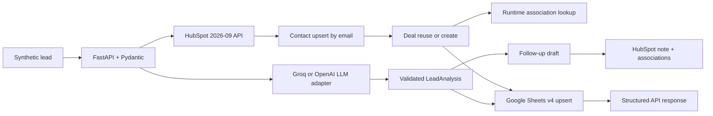

# AI Sales CRM Assistant

<p align="left">
  
  
  
  
  
  
  
</p>

A production-oriented portfolio proof of concept for an automotive dealership lead workflow. A single FastAPI request validates a synthetic lead, obtains schema-validated AI analysis, upserts HubSpot contact and deal records, preserves the AI output as a CRM note, and upserts a Google Sheets reporting row. Follow-ups are drafts only and always require human review.

HubSpot operations, Groq structured generation, Google Sheets synchronization and the complete cross-service workflow passed credential-gated development validation. OpenAI remains an optional, unverified provider switch.

## Architecture



Routes contain only HTTP concerns. `LeadService` owns orchestration, `CRMWorkflow` owns CRM sequencing, and separate adapters own Groq/OpenAI, HubSpot and Sheets transport. HubSpot and Sheets clients implement bounded exponential retries for timeouts, `429`, and transient `5xx` responses. See [docs/ARCHITECTURE.md](docs/ARCHITECTURE.md).

## Features

- Strict Pydantic validation for names, email, phone, budget, contact method, optional fields, and unknown input.
- Provider-switchable structured LLM output: Groq strict JSON Schema by default, or OpenAI SDK Pydantic parsing when selected.
- Deterministic, auditable urgency normalization so repeated processing cannot change CRM priority solely because of LLM sampling.
- Current HubSpot `2026-09` date-versioned REST endpoints for contacts, deals, notes, pipelines and associations.
- Contact create/update idempotency by normalized email.
- Deal duplicate protection by inspecting associated, open, matching-pipeline/vehicle deals.
- Runtime pipeline/stage validation and runtime HubSpot-defined association type discovery.
- CRM note containing summary, urgency, next action and unsent follow-up draft.
- Sheets v4 create-or-update behavior keyed first by CRM contact ID, then email.
- Safe exception mapping, JSON structured logs, workflow IDs, status/latency logging and no full-record logging.
- Mocked unit/API/end-to-end tests plus opt-in real integration validation.
- Offline benchmark and a live HTTP benchmark mode with separate, explicit evidence boundaries.

## Technology stack

| Layer | Technology | Purpose |
|---|---|---|
| Language | **Python 3.12+** | Typed asynchronous application and integration logic |
| API | **FastAPI**, **Uvicorn** | REST endpoints, dependency injection, OpenAPI documentation and ASGI serving |
| Validation | **Pydantic 2**, **pydantic-settings**, **email-validator** | Request validation, structured AI outputs and environment-backed configuration |
| AI | **Groq API**, **OpenAI Python SDK** | Live-verified Groq structured generation with a provider boundary for optional OpenAI switching |
| CRM | **HubSpot CRM REST API `2026-09`** | Contact/deal upserts, pipeline validation, associations and activity-note logging |
| Reporting | **Google Sheets API v4**, **Google Auth** | Service-account authentication and duplicate-safe pipeline-row synchronization |
| HTTP | **httpx** | Async external API transport, timeouts and mockable request handling |
| Observability | **structlog** | Structured workflow, operation, status and latency logging |
| Testing | **pytest**, **pytest-asyncio**, **HTTPX MockTransport** | Unit, API, retry, idempotency and opt-in live-integration validation |
| Quality | **Ruff**, **Coverage.py** | Linting, import checks and test-coverage support |
| Tooling | **python-dotenv**, **setuptools**, **Make**, **Docker** | Local configuration, packaging, repeatable commands and container execution |

The stack intentionally keeps the application small: FastAPI owns the HTTP boundary,
Pydantic enforces contracts, `httpx` adapters isolate external services, and the LLM
provider abstraction allows Groq and OpenAI to be switched without changing CRM workflow
logic.

## Quick start

```bash
python3.12 -m venv .venv
source .venv/bin/activate
python -m pip install -e '.[dev]'
cp .env.example .env
uvicorn app.main:app --reload --reload-dir app
```

Open `http://127.0.0.1:8000/docs` or check:

```bash
curl http://127.0.0.1:8000/health
```

Required configuration for the complete workflow:

| Variable | Purpose |
|---|---|
| `LLM_PROVIDER` | `groq` (default) or `openai` |
| `GROQ_API_KEY` | Required when `LLM_PROVIDER=groq` |
| `GROQ_MODEL` | Strict-output-capable Groq model; default `openai/gpt-oss-20b` |
| `OPENAI_API_KEY` | Required only when `LLM_PROVIDER=openai` |
| `OPENAI_MODEL` | OpenAI model; default `gpt-5-mini` |
| `LLM_TIMEOUT_SECONDS` | Shared provider timeout; default 30 seconds |
| `HUBSPOT_ACCESS_TOKEN` | Test-account OAuth token or scoped service key/access token |
| `HUBSPOT_API_VERSION` | Pinned to `2026-09` by default |
| `HUBSPOT_PIPELINE_ID` | Optional explicit pipeline; discovered if absent |
| `HUBSPOT_INITIAL_STAGE_ID` | Optional explicit initial stage; first active stage if absent |
| `GOOGLE_SHEETS_SPREADSHEET_ID` | Target test spreadsheet; Sheets is optional at startup |
| `GOOGLE_APPLICATION_CREDENTIALS` | Service-account JSON path; ADC is used if absent |
| `GOOGLE_SHEETS_WORKSHEET` | Worksheet title, default `Leads` |

Never commit `.env`, service-account JSON, OAuth tokens or access tokens. Full account instructions are in [docs/HUBSPOT_SETUP.md](docs/HUBSPOT_SETUP.md) and [docs/GOOGLE_SHEETS_SETUP.md](docs/GOOGLE_SHEETS_SETUP.md).

### Switching LLM providers

Groq is the default. Create a key in the [Groq Console](https://console.groq.com/keys), then configure:

```dotenv
LLM_PROVIDER=groq
GROQ_API_KEY=your-groq-key
GROQ_MODEL=openai/gpt-oss-20b
```

When OpenAI access is available, switch only these values and restart the API:

```dotenv
LLM_PROVIDER=openai
OPENAI_API_KEY=your-openai-key
OPENAI_MODEL=gpt-5-mini
```

Validate whichever provider is selected with `python3 scripts/verify_llm.py`. Provider-specific keys can coexist in `.env`; only the selected provider is used.

## API

```bash
curl -X POST http://127.0.0.1:8000/api/v1/leads/process \
  -H 'Content-Type: application/json' \
  -d '{
    "first_name":"Alex",
    "last_name":"Synthetic",
    "email":"alex.synthetic@example.com",
    "phone":"9015550123",
    "vehicle_interest":"2025 Honda CR-V",
    "budget":35000,
    "financing_interest":true,
    "trade_in_interest":true,
    "preferred_contact_method":"email",
    "notes":"Synthetic scenario: looking for an SUV this week."
  }'
```

Other endpoints:

```text
GET   /health
GET   /api/v1/leads/{email}
PATCH /api/v1/leads/{email}/stage   {"stage_id":"<validated HubSpot stage ID>"}
```

The process response includes `workflow_id`, CRM IDs, validated analysis, recommended action, draft, Sheets status, elapsed milliseconds and partial-failure warnings. A Sheets outage after CRM completion returns `partial_success`; invalid input is `422`; missing configuration is `503`; external failures are sanitized.

## Tests and verification

```bash
pytest -q
RUN_INTEGRATION_TESTS=true pytest -m integration -q
python3 scripts/verify_llm.py
python3 scripts/verify_hubspot.py
python3 scripts/verify_sheets.py
python3 scripts/benchmark.py --count 25
python3 scripts/benchmark.py --count 25 --base-url http://127.0.0.1:8000
```

The default benchmark uses deterministic mocked integrations and says so in the artifact. `--base-url` exercises the configured running application and can incur LLM usage and create synthetic HubSpot/Sheets records. Current measured results are in [docs/TEST_RESULTS.md](docs/TEST_RESULTS.md); do not describe the offline benchmark as external API performance.

## Idempotency

Contacts are searched by email and updated when present. The service retrieves that contact's associated deals and reuses an open deal in the selected pipeline whose name matches the vehicle interest. Sheets rows are matched by HubSpot contact ID, with email fallback. Reprocessing intentionally creates a new CRM note because each run is a distinct logged AI activity; it does not create a second contact, matching active deal or reporting row.

## Security and limitations

- The API itself has no caller authentication; deploy only behind an authenticated gateway.
- This is a portfolio POC, not a production dealership system or system of record.
- Customer text goes to the selected Groq or OpenAI account; a real deployment needs consent, retention and data-processing review.
- Logs omit full lead payloads and credentials, but CRM and Sheets hold PII and require access controls and retention policy.
- Local service-account credentials are supported for demonstration; workload identity is preferable in hosted environments.
- Sheets upsert is read-then-write and is not transactional under concurrent writers.
- LLM output assists organization only; it cannot approve financing or make regulated decisions.
- Follow-up text is never sent by this application.
- External verification is limited to synthetic development/test accounts and the measured results documented in [docs/TEST_RESULTS.md](docs/TEST_RESULTS.md); it is not evidence of production reliability.

## Further documentation

- [API decisions](docs/API_DECISIONS.md)
- [HubSpot setup](docs/HUBSPOT_SETUP.md)
- [Google Sheets setup](docs/GOOGLE_SHEETS_SETUP.md)
- [Architecture](docs/ARCHITECTURE.md)
- [Interview demo](docs/DEMO.md)
- [Verified test evidence](docs/TEST_RESULTS.md)
- [Resume evidence](docs/RESUME_EVIDENCE.md)
